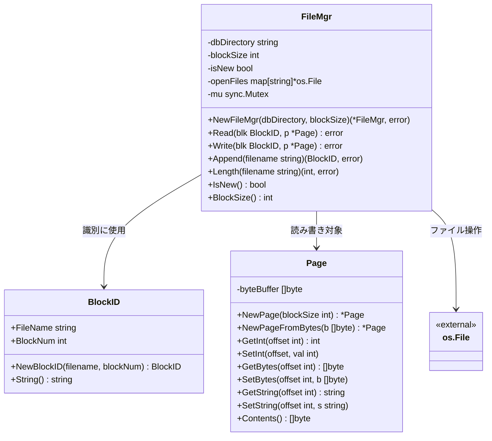
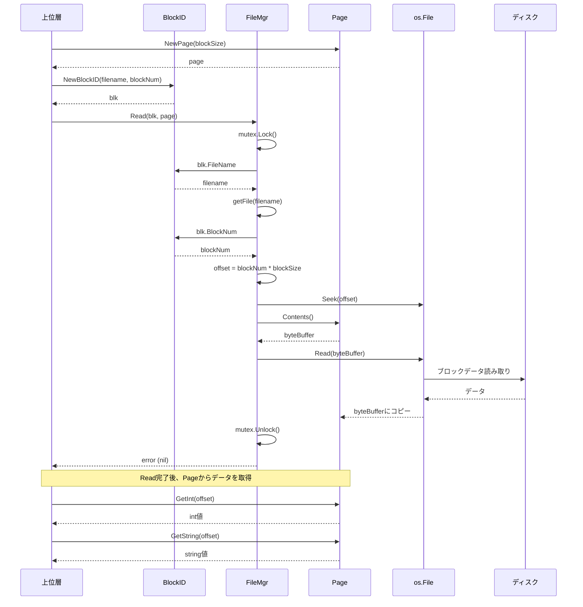
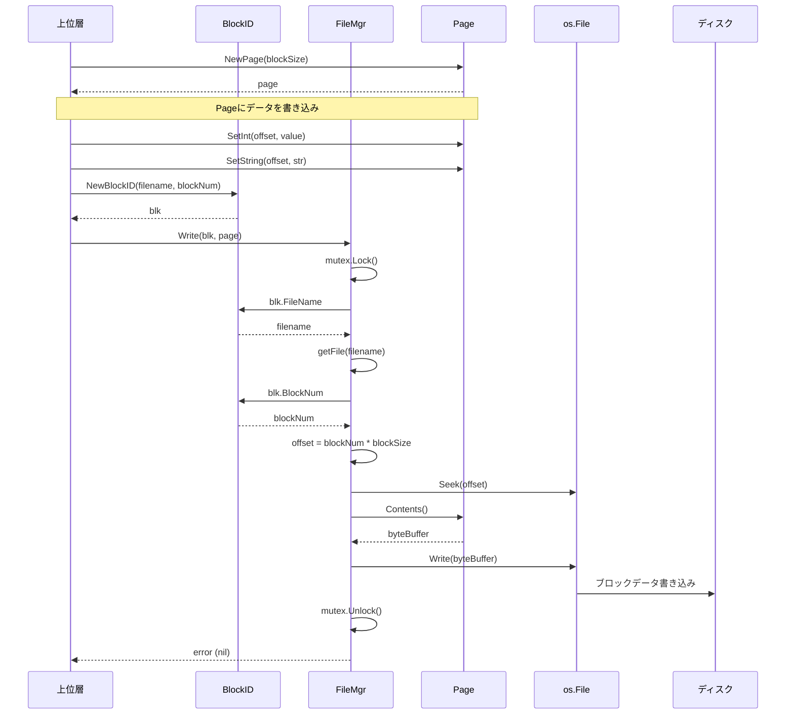
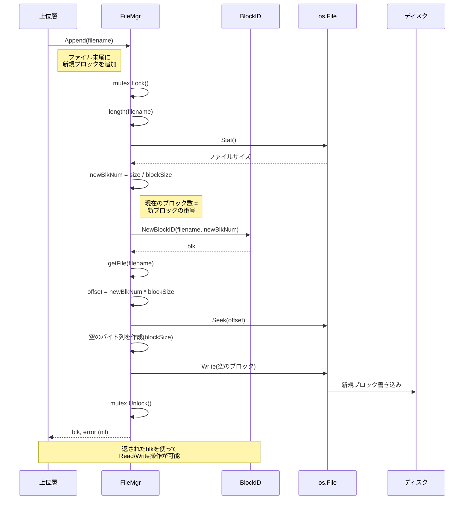

# file パッケージ

## 概要

`file` パッケージは、SimpleDBのディスク・ファイル管理層を実装します。データベースファイルへのブロック単位での読み書きを抽象化し、上位層（Buffer層、Transaction層など）にシンプルなインターフェースを提供します。

書籍「Database Design and Implementation」の **Chapter 3: Disk and File Management** に対応しています。

## パッケージの責務

- ディスク上のファイルをブロック単位で管理する
- ブロックの読み取り・書き込み・追加操作を提供する
- メモリ上のページとディスク上のブロック間のデータ変換を行う
- ファイルハンドルのキャッシュとスレッドセーフなアクセスを保証する

## コンポーネント図



## シーケンス図

### Read操作



### Write操作



### Append操作

ファイルの末尾に新しい空のブロックを追加し、そのBlockIDを返す操作です。
データベースファイルを拡張する際（例：既存ブロックに空きがなく新しいレコードを追加したい場合）に使用します。



## 型ごとの責務

### BlockID (Fig. 3.13)

ファイル内の特定のブロックを一意に識別する値オブジェクトです。

| フィールド | 型 | 説明 |
|-----------|-----|------|
| `FileName` | `string` | ブロックが属するファイル名 |
| `BlockNum` | `int` | ファイル内のブロック番号（0始まり） |

**主な用途:**
- `FileMgr` のRead/Write操作で対象ブロックを指定
- mapのキーとして使用可能（Goの構造体比較を利用）

### Page (Fig. 3.14)

ディスクブロックの内容をメモリ上に保持するバッファです。

| メソッド | 説明 |
|---------|------|
| `GetInt` / `SetInt` | 4バイト整数の読み書き（Big Endian） |
| `GetBytes` / `SetBytes` | 可変長バイト列の読み書き |
| `GetString` / `SetString` | 文字列の読み書き（ASCII前提） |
| `Contents` | 底層のバイトバッファを取得 |

**データフォーマット:**
- 整数: 4バイト（Big Endian）
- 可変長データ: `[長さ: 4バイト][データ本体]`

### FileMgr (Fig. 3.15)

ディスクへのブロック読み書きを管理する中心的なコンポーネントです。

| メソッド | 説明 |
|---------|------|
| `Read` | 指定したBlockIDのブロック内容をPageに読み込む |
| `Write` | Pageの内容を指定したBlockIDのブロックに書き込む |
| `Append` | ファイル末尾に新しい空ブロックを追加し、そのBlockIDを返す |
| `Length` | ファイル内のブロック数を取得 |

**各メソッドの詳細:**

- **Read**: `BlockID`で指定されたディスク上のブロックから、`Page`のバイトバッファへデータをコピー
- **Write**: `Page`のバイトバッファから、`BlockID`で指定されたディスク上のブロックへデータを書き込み
- **Append**: ファイルを拡張する際に使用。現在のファイルサイズから次のブロック番号を計算し、空のブロック（ゼロ埋め）を書き込んで新しい`BlockID`を返す。上位層はこの`BlockID`を使って後続のRead/Write操作を行う

**特徴:**
- すべての公開メソッドはスレッドセーフ（`sync.Mutex`で保護）
- ファイルハンドルをキャッシュし再利用
- 起動時に `temp` プレフィックスを持つ一時ファイルを自動削除

## 書籍との実装差分

### BlockID

| 項目 | 書籍 (Java) | 本実装 (Go) | 理由 |
|------|-------------|-------------|------|
| フィールドアクセス | getterメソッド | 公開フィールド | Go慣習（シンプルな構造体はフィールドを公開） |
| 等価性比較 | `equals()`, `hashCode()` | 削除 | Go構造体は `==` で比較可能、mapキーとしても使用可能 |

### Page

| 項目 | 書籍 (Java) | 本実装 (Go) | 理由 |
|------|-------------|-------------|------|
| バッファ | `ByteBuffer` | `[]byte` + `encoding/binary` | Go標準ライブラリを使用 |
| 文字セット | `Charset` (US_ASCII) | `BytesPerChar = 1` | GoにはCharset型がないため定数で表現 |
| コンストラクタ | オーバーロード | `NewPage` / `NewPageFromBytes` | Goはオーバーロード不可のため分割 |

### FileMgr

| 項目 | 書籍 (Java) | 本実装 (Go) | 理由 |
|------|-------------|-------------|------|
| ファイルアクセス | `RandomAccessFile` | `*os.File` | Go標準ライブラリを使用 |
| 同期制御 | `synchronized` | `sync.Mutex` | Go慣習 |
| エラー処理 | 例外 | `error` を返す | Go慣習（エラーは戻り値で返す） |

## 使用例

```go
// FileMgrの作成（ブロックサイズ400バイト）
fm, err := file.NewFileMgr("dbdir", 400)
if err != nil {
    log.Fatal(err)
}

// ブロック識別子の作成
blk := file.NewBlockID("testfile", 2)

// Pageにデータを書き込み
p := file.NewPage(fm.BlockSize())
p.SetString(0, "Hello, SimpleDB!")
p.SetInt(file.MaxLength(16), 12345)

// ディスクに書き込み
if err := fm.Write(blk, p); err != nil {
    log.Fatal(err)
}

// ディスクから読み込み
p2 := file.NewPage(fm.BlockSize())
if err := fm.Read(blk, p2); err != nil {
    log.Fatal(err)
}

fmt.Println(p2.GetString(0))              // "Hello, SimpleDB!"
fmt.Println(p2.GetInt(file.MaxLength(16))) // 12345
```

## 参考

- 書籍: [Database Design and Implementation](https://link.springer.com/book/10.1007/978-3-030-33836-7) - Chapter 3
- Figure番号: Fig. 3.12 ~ 3.15
